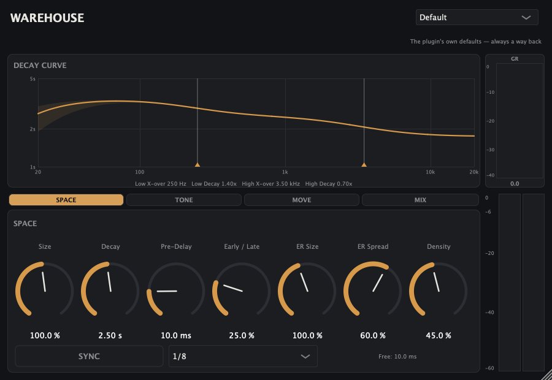

# Warehouse

**A house-focused algorithmic stereo reverb.** Free, open source, for macOS and Windows.
Ships as an Audio Unit and a VST3.

Sixteen presets named for what you are actually doing — *Drums — Tight Room*,
*Stabs — Short & Bright*, *DJ — Freeze Hold* — rather than for rooms you have never stood in.
A 16-line feedback delay network, a frequency-dependent decay you can drag with the mouse, a
dry-driven ducker, tempo-synced pre-delay and a bass-mono stage that keeps the low end out of
the tail.



| | |
|---|---|
| **Formats** | AU (`aufx Whs1 Emsz`) and VST3. A standalone app is built from source but deliberately not shipped in the installers. |
| **Platforms** | macOS 11.0+ (Universal — Apple Silicon *and* Intel), Windows 10/11 (64-bit) |
| **DAWs** | Logic Pro, Ableton Live, FL Studio, and anything else that hosts AU or VST3 |
| **Sample rates** | verified at 44.1 / 48 / 96 / 192 kHz |
| **Channels** | 1-to-1, 2-to-2, 1-to-2 |
| **Licence** | AGPLv3 — see [Licence](#licence) |

Mono in / stereo out is the interesting channel layout: the input is duplicated into both engine
channels, so a mono track gets a genuinely stereo tail rather than a mono one.

## Download

Grab the installer for your platform from the [**Releases**](../../releases) page.

| Platform | File | Installs |
|---|---|---|
| macOS | `Warehouse-<version>-macOS.pkg` | AU + VST3 into `/Library/Audio/Plug-Ins/` |
| Windows | `Warehouse-<version>-Windows.exe` | VST3 into `C:\Program Files\Common Files\VST3` |

Prefer to place the files yourself? Each release also carries a plain `.zip`.

> **macOS: the installer is not signed by Apple.** This is free software and an Apple Developer
> certificate is a $99/year subscription, so Warehouse ships unsigned. macOS will refuse to open
> the installer on the first try. The fix takes ten seconds and is in
> [Installing on macOS](#installing-on-macos) below — please read it before concluding the
> download is broken.

---

## Signal chain

```
in ──┬──────────────────────────────────── dry ─────────────────────────────┐
     │                                                                      │
     ├─▶ ducker (reads the DRY) ──────────────── duck gain ───────────┐      │
     │                                                                │      │
     └─▶ pre-delay ─▶ bandwidth LP ─┬─▶ early reflections ────────┐   │      │
         (0-500 ms,  (input tilt)   │   (10 taps + allpass smear) │   │      │
          tempo-sync)               │                             ▼   │      │
                                    └─▶ diffuser ─▶ FDN tank ─▶ ER/late ─┐   │
                                        (4 allpass)  (16 lines)  blend   │   │
                                                                         ▼   │
                                       wet EQ ─▶ width ─▶ bass mono ─▶ duck ─┤
                                    (cut/cut/tilt)  (M/S)  (mono <f)         │
                                                                             │
                                                          dry/wet mix ◀──────┘
                                                                │
                                                          output trim ─▶ out
```

**Pre-delay** — a fractional delay line per channel, up to 500 ms, so the reverb arrives after the
dry signal. Optionally **synced to host tempo** in eleven musical divisions; a division change
crossfades rather than glides, because gliding a pre-delay across a division is a pitch artefact.

**Bandwidth** — a one-pole lowpass on the tank input only. Rolling it down darkens the reverb
without touching the dry signal. This sets the tail's *initial timbre*, which is a different job
from High Decay and Wet High Cut — see the table under House-focused features.

**Early reflections** — ten fractional taps per channel plus a two-stage allpass smear, running
**parallel** to the late tank and blended against it by Early/Late. This is what gives the reverb a
sense of a *place* rather than a wash. Left and right use different tap tables, and ER Spread
interpolates between a shared mean and each channel's own — so it can be mono-tight or wide.
At Early/Late 0 the stage is a bit-exact identity: the late path is untouched, not merely quiet.

**Diffuser** — four cascaded Schroeder allpasses per channel. Left and right use *different* delay
lengths, which decorrelates the channels. Diffusion sets the allpass gain (0 – 0.7).

**FDN tank** — **sixteen** delay lines, 18 – 95 ms scaled by Size, each snapped to a **prime number
of samples** so the modes take a long time to realign (mutually prime lengths are what stop a short
FDN sounding metallic). The lines are mixed by an **orthogonal 16×16 Hadamard matrix**, applied as a
fast Walsh–Hadamard butterfly scaled by 1/4. Orthogonality is what makes the decay smooth and
Freeze exact.

Total delay is 750 ms at Size 100 %, and the Size map is *warped* so that even at Size 10 % the
tank keeps at least 0.125 s of total delay — below roughly that figure an FDN has too few modes to
sound colourless, and the earlier eight-line version was audibly metallic at small sizes.

Each line reads at a fractional position modulated by its own sine LFO, through a **five-point
Lagrange interpolator**. That kernel is not decoration: linear interpolation loses about 1.25 dB at
8 kHz per pass, and because a pass takes `m` samples that loss is a fixed dB *per pass* — the same
defect the attenuation filter below exists to remove. With linear interpolation the 8 kHz decay ran
58 % short at Size 50 % and 20 % short at the default modulation; with five-point Lagrange those
are 0.4 % and 2.7 %.

**Per-line attenuation filter** — this is the plugin's headline feature and it replaced a simpler
arrangement. Each line's feedback path carries a broadband scalar plus a low shelf and a high
shelf, **every dB value scaled by that line's length in samples**, satisfying

```
|Γᵢ(ω)| = 10^(mᵢ · γdB(ω) / 20)      with      γdB(ω) = −60 / (fs · T60(ω))
```

That per-line scaling is the whole point. A per-line shelf *without* it sounds plausible while the
lines decay at different rates, which is exactly what the earlier design did: it used a fixed
one-pole lowpass and highpass per line, and a fixed dB per pass over a pass of `mᵢ` samples means
dB-per-second scales as `1/mᵢ`. The lines disagreed. Measured per-line decay agreement is now
**1.007** where reinstating the old filter blows it to 1.86.

A fixed 5 Hz DC blocker sits in each feedback path, always on and not exposed. It is what makes
"DC cannot accumulate in the loop" an unconditional guarantee rather than a side effect of a
user-controllable highpass.

**Density** — a nested allpass inside each line, switched hard on or off rather than crossfaded.
A proportional crossfade between a bypass and an allpass has full nulls wherever the allpass is
180° out of phase, which would put a ~20 dB comb in the feedback loop — the opposite of what
density is for. Held at 0 or 1 the composite is either a pure allpass (|H| = 1) or a pure bypass.

Per-line feedback gain comes from the requested RT60: `g = 10^(-3·L/RT60)`, so the decay time means
what it says regardless of Size. Measured broadband accuracy is **0.3 %**.

**Wet level normalisation** — the tank injection gain is scaled by `√(1 − g²)`, which keeps the
steady-state wet level roughly independent of decay time. Without it a 30 s decay accumulates tens
of dB above the input. A further 3 dB of headroom is held back because the tank turns a uniform
input into a Gaussian-distributed tail, raising the crest factor by about 7 dB.

**Width** — mid/side on the wet signal only. 0% is a mono tail, 100% is unchanged, 200% doubles
the side component.

**Mix** — at Mix = 0 with Output at 0 dB the plugin is **bit-transparent**: the dry signal is not
multiplied or filtered at all, it is simply left alone.

### House-focused features

**Ducking.** The reverb steps out of the way while the dry signal plays and swells back in the
gaps — the most-used reverb move in dance music. Driven by the dry signal, not a sidechain input,
so there is nothing to route. `Duck Character` sets the detector, the knee *and* the attack
together: **Gentle** (30 ms attack, soft knee) breathes with the track; **Pump** (2 ms, hard knee)
is obviously rhythmic. `Duck Release` decides how the reverb recovers between kicks and is the
knob worth setting by ear. Measured on a four-to-the-floor loop: about **6.5 dB** of suppression
in the gaps between kicks, with the tail after the music stops left untouched.

**Duck Release** sets how quickly the reverb comes back after the ducking. Deep ducking adds time
on top of the knob — and it adds a fixed number of *milliseconds* rather than a percentage, so it
hardly shows at long settings and roughly doubles the short ones. At Duck Amount 100 with a low
threshold, a 50 ms setting recovers in about 100 ms on Gentle and 75 ms on Pump, which at 128 BPM
is still on its way back when the next 16th arrives.

Measured, recovery to two thirds of the way back:

| Duck Release | Gentle, deepest | Gentle, moderate | Pump, deepest | Pump, moderate |
|---|---|---|---|---|
| 50 ms | 103 ms | 65 ms | 75 ms | 57 ms |
| 250 ms | 297 ms | 263 ms | 272 ms | 256 ms |
| 1000 ms | 1043 ms | 1010 ms | 1016 ms | 1000 ms |

"Deepest" is 40 dB of reduction, "moderate" 12 dB. Note these are the two-thirds point, not full
recovery — at the 103 ms figure roughly 13 dB of ducking is still on the wet signal. Every number
here is asserted by the test suite against a closed-form model of the detector, not merely printed.

Ducking stays live while Freeze is engaged — an infinite pad that ducks under the kick is the
point, and the duck gain is applied outside the feedback loop so it cannot affect the frozen tail's
stability.

**Tempo-synced pre-delay.** Sync the pre-delay to the host tempo in eleven musical divisions from
1/32 to 1/1, clamped at 500 ms. A division change **crossfades rather than glides** — gliding a
pre-delay across a musical division is a pitch artefact, not a feature. When the host reports no
tempo the plugin falls back to the typed millisecond value, and if the host reports tempo only
while playing, the last known tempo is held so the reverb does not jump when you press stop.

**Bass mono.** Sums the wet signal below an adjustable corner to mono, so a wide reverb still
translates on a club system. Implemented as an exact complementary split — the mid signal is
untouched, and the whole stage is a bit-exact identity on mono input.

Note this needed a second-order filter rather than the cascaded one-poles originally specified.
The side signal comes out as `(1 − LP)·(L−R)`, and for cascaded one-pole lowpasses the leading
term of that expression is *linear in frequency* — so the rejection stays 6 dB/oct no matter how
many you cascade. At a 130 Hz corner that left the side signal only 1.7 dB down at 65 Hz, which
would have made the control's name a fiction.

**Wet-only EQ.** Low cut, high cut and a tilt on the wet path, separate from the tank's decay
controls. Three controls touch high frequencies and each does exactly one thing:

| Control | What it does |
|---|---|
| `Bandwidth` | the tail's **initial timbre** — filters the signal going *into* the reverb |
| `High Decay` | **how fast the top dies** — the treble's decay time, not its level |
| `Wet High Cut` | the **wet signal's tone** on the way out |

`Wet Tilt` is the full top-to-bottom tilt, pivoting at 1 kHz: +12 dB means +6 dB of treble and
−6 dB of bass. The pivot is the geometric mean of the two Decay-EQ crossover defaults, so both EQs
hinge in the same place.

### Known limits

The plugin can run hot at its extremes, and the honest way to state that is **not** a single peak
figure. At its worst reachable corner the wet output is close to Gaussian, so its *maximum* grows
as `sqrt(2 ln N)` with the length of the run and never settles: measured at one corner, the largest
sample seen was +9.4 dBFS over 30 seconds, +10.0 dBFS over 600 seconds, and would keep creeping.
The quantity that *is* stationary is the RMS, which settles within 60 seconds and then holds to
better than 0.1 %.

Measured at Mix 100 %, unity Output trim, full-scale broadband input, after the tank has charged:

| Condition | RMS | Observed peak | in σ |
|---|---|---|---|
| Worst reachable corner (Size 200 %, Decay 30 s, flat Decay EQ, density/bass-mono/early all off) | −4.8 dBFS | +9.4 dBFS | 5.1 |
| Same, both decay multipliers at maximum | −6.0 dBFS | +8.5 dBFS | 5.3 |
| Size 200 %, Decay 30 s at the *default* early/late and density | −9.2 dBFS | +4.6 dBFS | 4.9 |
| The same corner at 192 kHz | −9.7 dBFS | +5.1 dBFS | 5.5 |

Every configuration measured lands between **4.9 and 5.7 σ** — a tight enough cluster across twelve
settings that it confirms the Gaussian description rather than assuming it, and it is why the test
suite asserts a **divergence ceiling** (+12 dBFS, about 6.9 σ, roughly one expected exceedance per
fortnight of continuous audio) instead of a peak specification. A ceiling at that height is not
lenience: a feedback loop that has actually gone unstable grows exponentially and passes it within
seconds, whereas legitimate Gaussian crest never does.

Two consequences worth knowing:

- **There is deliberately no output limiter.** The plugin never alters the shape of what it
  produces; gain staging stays yours. Use the Output trim if a hot corner clips a bus.
- **Wet Tilt is excluded from those figures by construction.** It is a ±12 dB EQ, so a positive
  tilt breaks any absolute ceiling on its own — the same reason the Output trim is excluded. Both
  are gain controls, and a gain control's job is to change the gain.

The 192 kHz corner measures about 4.9 dB quieter than the 48 kHz one at identical settings. That is
expected rather than a bug: `Bandwidth` tops out at 20 kHz, which is most of the spectrum at a
48 kHz sample rate and a small fraction of it at 192 kHz.

**Do not quote these peaks to four significant figures.** A long run through a feedback network is
chaotic, and the fourth digit shifts by around 0.2 dB between builds whose only difference is
floating-point contraction under optimisation. The RMS and σ figures are stable; the peaks are
illustrative.

Earlier versions of this file quoted **+3 dBFS**, then **+5.81 dBFS**, then **+5.63 dBFS** as "the
worst case". All three were wrong, and not merely imprecise: the first predated early reflections,
the second and third came from a test whose "worst case" configuration left four peak-*reducing*
parameters at their defaults. They are recorded here because a number that quietly changes three
times is how a document stops being trustworthy.

A non-finite input sample (NaN or ±inf, e.g. from an upstream plugin) is replaced with silence
before it reaches either the feedback network or the output.

---

## Parameters

All 29 are host-automatable. Grouped as the GUI groups them.

**Space** — the room itself

| Control | ID | Range | Default | Notes |
|---|---|---|---|---|
| Size | `size` | 10 – 200 % | 100 % | scales the tank delays; warped so Size 10 % still clears the density floor |
| Decay | `decay` | 0.1 – 30 s | 2.5 s | RT60 in real seconds, accurate to 0.3 %; skewed, centre 3 s |
| Pre-Delay | `predelay` | 0 – 500 ms | 10 ms | skewed, centre 100 ms. Overridden when Sync is on |
| Pre-Delay Sync | `pdsync` | on / off | off | sync the pre-delay to host tempo |
| Pre-Delay Division | `pddiv` | 1/32 … 1/1 | 1/8 | eleven divisions; clamps at 500 ms |
| Early / Late | `ermix` | 0 – 100 % | 25 % | 0 % is a bit-exact identity on the late path |
| ER Size | `ersize` | 25 – 200 % | 100 % | scales the early tap times |
| ER Spread | `erspread` | 0 – 100 % | 60 % | early stereo width; 0 % is a mono early field |
| Density | `density` | 0 – 100 % | 45 % | nested allpass per line; 0 % is a bit-exact bypass |

**Tone** — the Decay EQ. Drag these on the curve rather than as knobs.

| Control | ID | Range | Default | Notes |
|---|---|---|---|---|
| Low Decay | `decaylow` | 0.1 – 4.0 × | 1.4 × | multiplies Decay below the low crossover |
| High Decay | `decayhigh` | 0.05 – 4.0 × | 0.7 × | multiplies Decay above the high crossover |
| Low X-over | `lowcut` | 60 – 800 Hz | 250 Hz | where the low band starts. **Was "Low Cut" in v0.1** |
| High X-over | `damping` | 1000 – 12000 Hz | 3500 Hz | where the high band starts. **Was "HF Damping" in v0.1** |
| Bandwidth | `bandwidth` | 1000 – 20000 Hz | 16000 Hz | lowpass on the tank *input* — the tail's initial timbre |

**Move** — modulation

| Control | ID | Range | Default | Notes |
|---|---|---|---|---|
| Mod Depth | `moddepth` | 0 – 100 % | 25 % | up to ±8 samples of delay modulation |
| Mod Rate | `modrate` | 0.01 – 5 Hz | 0.4 Hz | skewed, centre 0.5 Hz |
| Diffusion | `diffusion` | 0 – 100 % | 70 % | input allpass gain, 0 – 0.7 |
| Freeze | `freeze` | on / off | off | holds the tail indefinitely; see below |

**Mix** — output stage and the ducker

| Control | ID | Range | Default | Notes |
|---|---|---|---|---|
| Mix | `mix` | 0 – 100 % | 35 % | 0 % is bit-transparent |
| Width | `width` | 0 – 200 % | 100 % | mid/side on the wet signal only |
| Output | `output` | −24 – +12 dB | 0 dB | 0 dB is an exact unity pass |
| Duck Amount | `duckamt` | 0 – 100 % | 0 % | 0 % returns exactly 1.0 — a true bypass |
| Duck Threshold | `duckthresh` | −60 – 0 dB | −24 dB | on the dry signal's envelope |
| Duck Release | `duckrelease` | 20 – 1000 ms | 250 ms | **lengthens with reduction depth** — see House features |
| Duck Character | `duckchar` | Gentle / Pump | Gentle | sets detector, knee *and* attack together |
| Bass Mono | `bassmono` | 0 – 400 Hz | 250 Hz | sums the wet below this to mono; 0 is off |
| Wet Low Cut | `wetlowcut` | 20 – 1000 Hz | 20 Hz | on the wet only; 20 Hz is a bit-exact bypass |
| Wet High Cut | `wethighcut` | 1000 – 20000 Hz | 20000 Hz | on the wet only; 20 kHz is a bit-exact bypass |
| Wet Tilt | `wettilt` | −12 – +12 dB | 0 dB | full top-to-bottom tilt about 1 kHz; ±6 dB per side |

**Note on two renamed controls.** `damping` and `lowcut` kept their parameter IDs so existing host
automation lanes keep working, but their *meaning* changed: they were filter cutoffs in the
feedback path in v0.1 and are now the Decay EQ's two crossover frequencies. A v0.1 session loads
with every value intact, but the tank was rebuilt in v0.2 and the tail is denser and voiced
differently — the values survive, the sound does not.

### Freeze

Freeze sets every feedback gain to exactly 1, crossfades the damping and low-cut filters out, ramps
the modulation depth to zero, snaps each delay length to a whole number of samples, and ramps the
tank input to zero. Because the read positions then land on exact samples and the mixing matrix is
orthogonal, the loop is lossless and the tail holds indefinitely — measured drift is −0.06 dB over
five seconds.

### Presets

Sixteen, named for **what you reach for** rather than for a room type, and prefixed so they group
usefully in a host's alphabetical preset menu. Each carries a one-line description, shown in the
editor under the preset menu. All sixteen are exposed as AU factory presets, so Logic lists them in
its own menu.

| Preset | For |
|---|---|
| `Default` | the plugin's own defaults — always a way back |
| `Drums — Tight Room` | weight and space on drums with no wash |
| `Drums — Snare Plate` | bright medium plate for snares and claps |
| `Stabs — Short & Bright` | the classic house chord stab: quick, bright, out of the way |
| `Stabs — Deep & Warm` | deep-house chords; warmer, bass lingers |
| `Vocal — Ducked Send` | full-wet send that ducks under the vocal |
| `Vocal — Wide Plate` | big glossy plate, wide, low end kept out |
| `Bass — Club Safe` | space on low material without mud on a club rig |
| `Pads — Big Wash` | long, dark and wide; everything blurs together |
| `Pads — Slow Bloom` | arrives late and swells, in time with the track |
| `Atmos — Glue` | very short, mostly early reflections; makes a dry mix sit |
| `Space — Cathedral` | the biggest, darkest, longest |
| `Space — Dub Chamber` | long, dark, heavily modulated and filtered |
| `DJ — Freeze Hold` | endless tail; holds until you let go |
| `DJ — Riser Wash` | huge bright wash for build-ups |
| `DJ — Slam Verb` | hard rhythmic pumping; extreme ducking |

Two ship with the **ducker already on** — `Vocal — Ducked Send` (Gentle, modest) and `DJ — Slam
Verb` (Pump, extreme). That is deliberate: a feature defaulting to 0 % is a feature nobody finds.

`Vocal — Ducked Send` is the only preset at **100 % wet**, because that is what a send is. On an
insert it will sound entirely wet until you pull Mix down.

A few of the choices, since they explain the voicing:

- `Drums — Tight Room` and `Atmos — Glue` get their space from the **early reflections**, not the
  tail — a short decay with a high Early/Late. That is what "space without wash" means.
- `Stabs — Short & Bright` leans on a **250 Hz wet low cut**: the tail physically cannot muddy the
  low mid, which is what lets you use more of it against a busy kick and bass.
- `Bass — Club Safe` is all subtraction — bass mono at its maximum and the narrowest width in the
  set, because a wide low-frequency reverb is what smears a club system.
- `Pads — Slow Bloom` syncs to a **1/4 note** rather than something longer, because the synced
  pre-delay clamps at 500 ms and a quarter note at house tempo is 469–484 ms: the longest division
  that still tracks the tempo instead of sitting pinned at the clamp.

**What the tests do and do not guarantee about these.** Every preset is verified to set all 29
parameters, to be distinct from its neighbours, and for each value to actually reach its parameter
— which catches a table entry that is out of range and would otherwise be clamped silently. What no
test can check is whether a preset *sounds* like its name. A wrong-but-in-range value is only
catchable by ear.

---

## Building

Building it yourself is the alternative to trusting an unsigned binary, and it is not hard.

**Requirements:** CMake 3.22+, and either Xcode command line tools (macOS) or Visual Studio 2022
with the C++ workload (Windows).

JUCE 9.0.1 is **not** committed here — it is a git submodule pinned to a specific commit, so clone
recursively:

```sh
git clone --recurse-submodules https://github.com/remicaesar/warehouse-reverb.git
cd warehouse-reverb
```

Already cloned without `--recurse-submodules`? Then:

```sh
git submodule update --init --recursive
```

If `libs/JUCE` is empty, this is why, and CMake will fail on `add_subdirectory(libs/JUCE)`.

### macOS

```sh
bash scripts/build.sh                 # Release, host architecture only (fast)
bash scripts/build.sh --debug         # Debug
bash scripts/build.sh --universal     # arm64 + x86_64 fat binaries
bash scripts/build.sh --clean         # wipe build/ first
bash scripts/build.sh --target WarehouseTests
```

Artefacts land in `build/Warehouse_artefacts/Release/`:

```
AU/Warehouse.component
VST3/Warehouse.vst3
Standalone/Warehouse.app
```

`Warehouse.app` is the standalone build. It is useful for testing without a DAW, and is
deliberately **not** included in either installer.

The AU and VST3 bundles are ad-hoc codesigned as a post-build step. Logic on Apple Silicon will not
load an unsigned locally built AU.

Release builds for distribution must use `--universal`. See the
[Apple Silicon note](#apple-silicon-note) for why a thin arm64 VST3 is not good enough.

`UNIVERSAL_BINARY` forces `CMAKE_OSX_ARCHITECTURES` on **both** branches. It used to set the cache
entry only when switched on, so running `--universal` once in a build directory left it cached as
fat forever and every later plain build in that directory silently stayed fat.

`packaging/build-pkg.sh` refuses to package a bundle that is missing either the `arm64` or the
`x86_64` slice, so a release cut by hand cannot accidentally ship a thin binary.

A local build **installs itself** into `~/Library/Audio/Plug-Ins/` so a rebuild is immediately
visible in your DAW. Pass `-DWAREHOUSE_INSTALL_AFTER_BUILD=OFF` to switch that off — which you want for
CI, and for any build that deliberately breaks the plugin (a mutation test, a bisect), because
otherwise the broken build lands on top of your working install.

### Windows

```
cmake -S . -B build -DCMAKE_BUILD_TYPE=Release
cmake --build build --config Release --parallel
```

Artefacts land in `build\Warehouse_artefacts\Release\VST3\Warehouse.vst3`. There is no Audio
Unit target on Windows; CMake omits it automatically.

The AU is declared **sandbox-safe**. Without that declaration JUCE writes a `resourceUsage` dict
into the AU's `Info.plist` claiming network-client access and read-write access to every file on
disk; this reverb touches neither. The VST3 is tagged `Fx|Reverb`, so hosts file it under reverbs
rather than in a generic effects bucket.

### Tests

Two suites, both console apps, both exiting non-zero on any failure.

```sh
bash scripts/build.sh --target WarehouseTests
./build/WarehouseTests_artefacts/Release/WarehouseTests

bash scripts/build.sh --target WarehouseProcessorTests
./build/WarehouseProcessorTests_artefacts/Release/WarehouseProcessorTests
```

`WarehouseTests` links only `juce_dsp` and `juce_audio_basics` — the DSP is deliberately free of any
GUI dependency. It exercises `ReverbEngine` directly: delay-line bounds, silence in/out,
bit-transparency at Mix = 0, RT60 accuracy via Schroeder integration, a 30 s randomised stability
sweep at all four sample rates, a pinned worst-case corner, Freeze hold under both open and dark
filter settings, Freeze rejecting new input, `reset()`, the mono path, non-finite input containment,
and the oversized-block chunking path. It also prints CPU time per block.

`WarehouseProcessorTests` compiles the processor itself and covers the layer the DSP suite cannot
reach: the 13-parameter state round trip, malformed state being ignored, editor-size persistence,
the sixteen programs and their persistence, bus-layout negotiation including 1→2, oversized blocks
through `processBlock`, two independent instances, a sample-rate change mid-session, and the tail
length reported to the host.

`REVERB_SWEEP_SEEDS=96` runs a deeper version of the stability sweep. A single seed is weak
evidence: a marginally unstable FDN diverges on some parameter trajectories and not others.

Several of these checks exist because a weaker version of them passed against a deliberately broken
build. Each one that guards a specific mechanism has been confirmed to fail when that mechanism is
mutated out — a test that stays green under its own mutation is not evidence of anything.

## Installing

### Installing on macOS

1. Download `Warehouse-<version>-macOS.pkg` from [Releases](../../releases).
2. Double-click it. **macOS will refuse to open it** — *"Apple could not verify Warehouse is free
   of malware"* or *"cannot be opened because it is from an unidentified developer"*. This is
   expected: the installer is unsigned. Click **Done** / **OK** to dismiss it.
3. Open **System Settings → Privacy & Security**, scroll down to the **Security** section. There
   will be a line saying Warehouse was blocked, with an **Open Anyway** button. Click it, confirm
   with your password, and the installer runs.
4. macOS asks for your password again during install: the Audio Unit goes into `/Library`, not
   your home folder.
5. Restart your DAW.

> Older instructions for unsigned software tell you to right-click and choose **Open**. That
> shortcut was **removed in macOS 15 (Sequoia)** — on any current macOS the System Settings route
> above is the one that works.

If you would rather not go through System Settings, this does the same thing from a Terminal:

```sh
xattr -dr com.apple.quarantine ~/Downloads/Warehouse-*-macOS.pkg
```

It strips the download quarantine flag, after which the installer opens on a normal double-click.

You can inspect exactly what the installer will do before running it, if you would rather not take
it on trust:

```sh
pkgutil --expand-full ~/Downloads/Warehouse-*-macOS.pkg /tmp/warehouse-inspect
```

**Why unsigned?** Signing and notarising a macOS installer requires paid Apple Developer Program
membership. Warehouse is free and the source is right here, so you can build it yourself instead
if you would rather not trust a stranger's binary — see [Building](#building).

Installed locations:

| | |
|---|---|
| Audio Unit | `/Library/Audio/Plug-Ins/Components/Warehouse.component` |
| VST3 | `/Library/Audio/Plug-Ins/VST3/Warehouse.vst3` |

These are the **system-level** folders, deliberately. FL Studio's own documentation only lists the
system-level `Components` folder for Audio Units, so an AU installed into `~/Library` may simply
never appear there.

To uninstall, delete those two paths.

> **If you also build from source**, note that a local build installs to `~/Library/Audio/Plug-Ins/`
> while the installer uses `/Library/Audio/Plug-Ins/`. With both present your DAW will list
> Warehouse twice and load whichever it scanned first — which is not necessarily the newer one.
> Keep one or the other, not both.

### Installing on Windows

1. Download `Warehouse-<version>-Windows.exe` from [Releases](../../releases).
2. Run it. Windows SmartScreen will warn you that the publisher is unknown — same reason as
   macOS, no paid certificate. Click **More info** then **Run anyway**.
3. Restart your DAW.

The VST3 goes to `C:\Program Files\Common Files\VST3\Warehouse.vst3`, which is the location
Steinberg's specification requires and the only one FL Studio guarantees to scan. There is no
Audio Unit on Windows — that format is macOS-only.

Uninstall through **Settings then Apps**, or delete the `.vst3` file.

### Getting your DAW to see it

| DAW | Format it will use | What to do |
|---|---|---|
| **Logic Pro** (macOS) | AU | Just restart Logic. It rescans Audio Units at launch. Find it under **Audio FX / Reverb / Warehouse**, or search the plugin menu. |
| **Ableton Live** (macOS) | VST3 or AU | Restart Live. If it does not appear: **Preferences / Plug-Ins**, then **Rescan**. |
| **Ableton Live** (Windows) | VST3 | **Preferences / Plug-Ins / Use VST3 Plug-in System Folder: On.** Live will not scan the standard folder at all until you switch this on. Then **Rescan**. |
| **FL Studio** (macOS) | VST3 or AU | **Options / Manage plugins / Find more plugins.** FL does not refresh its list on its own. If you run FL in both native and Rosetta modes, you must rescan separately in each. |
| **FL Studio** (Windows) | VST3 | **Options / Manage plugins / Find more plugins.** |

### If Logic still cannot find it

Logic caches its Audio Unit scan. Quit Logic, then:

```sh
killall -9 AudioComponentRegistrar
```

and relaunch. You can confirm the plugin is valid independently of any DAW with Apple's own
validator:

```sh
auval -v aufx Whs1 Emsz
```

`AU VALIDATION SUCCEEDED` means the plugin is fine and the problem is Logic's cache.

### Apple Silicon note

The macOS build is **Universal** (arm64 + x86_64), which matters more than it sounds: Ableton
Live on Apple Silicon *silently ignores* any VST3 that is not built natively for Apple Silicon —
no error, the plugin simply is not in the list. A Universal build sidesteps that for everyone.

---

## Licence

Warehouse is licensed under the **GNU Affero General Public License, version 3 or later**
(AGPLv3+). The full text is in [`LICENSE`](LICENSE); third-party attributions are in
[`NOTICE`](NOTICE).

In plain terms: you may use it, for anything including commercial music, at no cost. You may
modify it and redistribute it. If you distribute a modified version, or run it as a network
service, you must make your source available under the same licence.

The licence is AGPLv3 because Warehouse links **JUCE 9**, which is dual-licensed AGPLv3 or
commercial. Releasing this source publicly under the AGPL is a complete discharge of JUCE's free
option — no payment, no splash screen, no obligation beyond keeping the source open. The bundled
**VST3 SDK** is MIT-licensed (Steinberg, 2025), so it adds no restrictions of its own.

No third-party reverb code was copied into this project. The DSP was implemented from published
technique — feedback delay networks, Schroeder allpass diffusion, Jot's attenuation-filter decay
law — rather than adapted from any existing implementation. See `NOTICE`.

VST is a trademark of Steinberg Media Technologies GmbH. Audio Units and Logic Pro are trademarks
of Apple Inc. Ableton Live is a trademark of Ableton AG. FL Studio is a trademark of Image-Line
NV. Those names appear here to describe compatibility only; no affiliation or endorsement is
implied.
